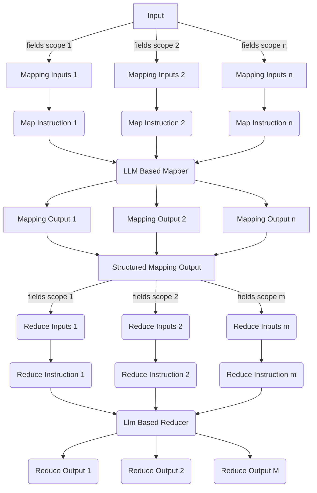

# Instructions MapReduce
Similar with Hadoop MapReduce, but this time we map "instructions" into LLM's responses, and then reduce these response to the final results or next Map/Reduce's inputs.

## Architecture

