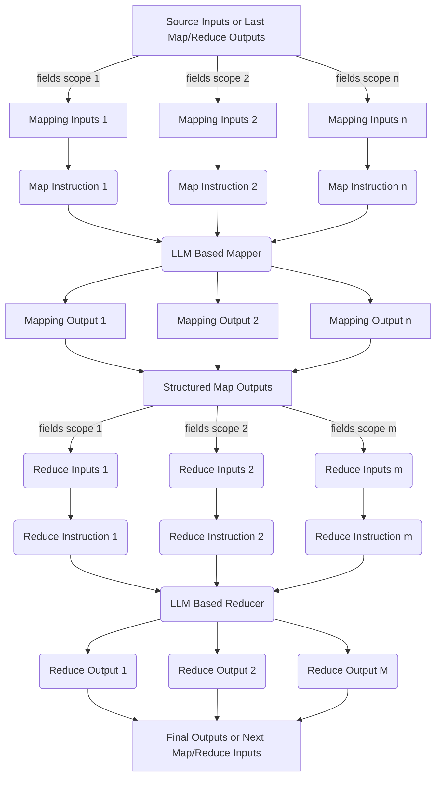
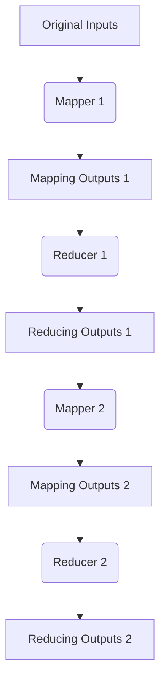

# Instructions MapReduce
## Background
Nowadays LLMs are very popular with text generation tasks (like QA and summarization), but there are still some potential blockers prevent users having high quality results:
* **Omission**: LLMs can not get user's intention very clearly, so it will casually miss sth important.
* **Hallucination**
* **Long Input**: Sometimes the input text can be vary long, which will increase the chance of omission and hallucination, also cause high latency.

To solve above problems, here I propose **InstructionsMR** framework. This is similar with Hadoop MapReduce, but here we map "instructions" into LLM's responses, and then reduce these response to the final results or next Map/Reduce's inputs.

## Architecture
### Single MapReduce Flow


### MapReduces Flow


## Advantages
### Customization
* Via the configuration of map instructions, users can set:
  * The key information they want focus on.
  * The fields of data they need to finish this instruction.
* Via the configuration of reduce instructions, users can set:
  * How to group multiple mapping results together into a reduce result.
  * So can define final output format.

### Parallelization
All LLMs calling in this implementation are done via `async` in Python, which means we can parrallelize both map and reduce with using `Instruction` as minimum parallization unit.

Especially for mapping, it's kind of split a single prompt into several small units and run them at same time. If not, when you have a long input, you may have to generate a long output token by token sequentially. But with mapping, you can have multiple inference run at same time, each will generate a much shorter output. Of course this also means the you need run inference for prefix conditioning multiple time. But as this stage is naturally faster than decoding, not mention we can have some **prefix cache** machemanism, the overall latency should be still more friendly.

### (Custmoized) Information Retrieval
When input is too long, there's higher probability of hallucination and missing information. So for each instruction, instead of feeding all inputs, we can only feed relevant information to LLMs to follow instruction.

To do above, we first have each mapper/reduce have a JSON input, which each key corresponding with one data. In defination of struct `Instruction`, there's an member variable called `scope`, which can define to follow this instruction, which fields from inputs will be used.

### Omission & Hallucination Checking
As each map/reduce is an independent LLM calling, you can fit any prompt-engineering based text generation technique in the concrete mapper/reducer implementation to solve the problem of omission & hallucination problems.

## Drawbacks
### Can Not Streaming E2E
As each map/reduce (except the initial ones) depends on previous map/reduce's outputs, so we can only streaming the last input but not the intermediate ones.
### Can Not 100% Eliminate Hallucinations and Omissions
This is for sure for all LLMs based solutions.

## Q&A
* For long document, why don't RAG to retrive most relevant parts?
  * For POC key based retrieval is enought, but yes RAG is necessary for long term.
* Why didn't use LangChain or some other prompt-engineering frameworks?
  * No need to include unnecessary abstractions.

## POC
Here I build a POC for EHR documents summarization. The input is a semi-structured JSON EHR generate by ChatGPT with [prompt](https://chatgpt.com/share/6737c642-68ac-800d-ab0f-e3403a3dad89).

We can use a single MR to solve this problem.

### Source Inputs
```json
{
  "patient": {...},
  "allergies": [...],
  "diagnosis": [...],
  "encounters": [...],
  "labs": [...],
  "medications": [...],
  "procedures": [...],
  "visits": [...],
  "notes": [...]
}
```

### Reducer
Reducer here are just multiple "Re-writing" instructions running at same time on outputs of specific instructions in mapping stage.

```json
{
  "Demography": "...",
  "Personal Histories": "...",
  "(Historical) Subjectives": "...",
  "(Historical) Objectives": "...",
  "(Historical) Assessments": "...",
  "(Historical) Plans": "..."  
}
```

### Final Outputs
```
# Demography
...

# Personal Histories
...

# (Historical) Subjectives
...

# (Historical) Objectives
...

# (Historical) Assessments
...

# (Historical) Plans
... 
```

## Cite This Work
```
@software{Liu_Instructions-MapReduce_2024,
author = {Liu, Yutong},
month = nov,
title = {{Instructions-MapReduce}},
url = {https://github.com/innerNULL/instructions-mr/tree/main},
version = {0.0.1},
year = {2024}
}
```

## References
* [Hadoop MapReduce](https://hadoop.apache.org/docs/r1.2.1/mapred_tutorial.html)
* [MapReduce: Simplified Data Processing on Large Clusters](https://static.googleusercontent.com/media/research.google.com/en//archive/mapreduce-osdi04.pdf)
* [Self-Verification Improves Few-Shot Clinical Information Extraction](https://arxiv.org/abs/2306.00024)
